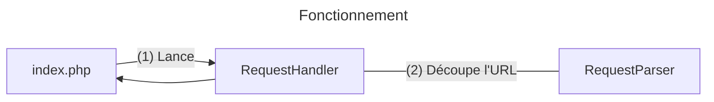

# Le lexique Libanais de Makki : **Note d'architecture**

Cette note d'architecture décrit la structure du système et son fonctionnement global.

## Historique

| version | date | changements |
|---------|----|-------------|
| 1.0     |23/02/2024| v. initiale |

## Fonctionnement général

Lorsqu'une requête est envoyée au serveur, celui-ci remonte le chemin de l'url. Si l'on a `http://www.serveur.fr/makki/lexique?coverage=Nord+du+Liban`, et que le dossier `makki` est là où se trouvent les fichiers du site, le serveur s'arrête là à la lecture de l'url car le fichier [`.htaccess`](.htaccess) définit une règle de réécriture qui renvoie toute requête lui parvenant au script php [`index.php`](index.php).  

Ce script récupère les principales informations de configuration de [config](config) et instancie un objet de la classe [RequestHandler](api/handler.php), qui effectue la majeure partie du travail et coordonne tout le **traitement de la requête**.  

C'est ensuite le [RequestParser](api/parser.php) qui s'occupe de **découper l'url** :
- `/lexique/bla` donne alors `{'collection' : 'lexique', 'target' : 'bla'}`
- `/fr/lexique?coverage=Tripoli` donne `{'collection' : 'lexique', 'lang' : 'fr', 'query' : {'coverage' : 'Tripoli'}}`
- `/images/logo.png` donne `{'collection' : 'images', 'target' : 'logo.png'}`

Et ainsi de suite...  

L'utilisateur est ensuite **authentifié** si un cookie de session est fourni, notamment en s'appuyant sur [l'implémentation de signature, vérification, chiffrement et déchiffrement de tokens](api/jwt.php).  

L'étape suivante est la **négociation de langue** : définir un ordre de priorité des langues disponibles en fonction des informations de l'utilisateur. L'idée est la suivante : 
- On récupère dans la base de données les langues d'interface disponibles
- Si une langue est précisée dans l'url et qu'elle est disponible, on la considère comme étant la plus importante
- Les langues définies à travers [l'en-tête HTTP *Accept-Language*](https://developer.mozilla.org/fr/docs/Web/HTTP/Headers/Accept-Language) et disponibles sont classées selon l'ordre défini par le navigateur (grâce au coefficient *q*)
- Si le français est disponible et pas déjà présent dans les langues précédemment ajoutées, on lui donne la plus petite priorité (en dernier recours) 

Une fois cela fait, on passe au traitement de la requête proprement dit. Le système gère trois **méthodes HTTP** :
- [GET](https://developer.mozilla.org/fr/docs/Web/HTTP/Methods/GET), qui permet de récupérer des informations du serveur sous la forme de documents (on parle de "représentation de ressource") ; il peut s'agir d'images, de scripts, d'html, de json, de xml... Le type de contenu ([dit aussi type MIME](https://fr.wikipedia.org/wiki/Type_de_m%C3%A9dias), et défini dans la réponse par [l'en-tête HTTP *Content-Type*](https://developer.mozilla.org/fr/docs/Web/HTTP/Headers/Content-Type)) est défini de deux manières possibles : si la `collection` est `images`, `scripts`, `styles` ou `fonts`, il s'agit d'une ressource visuelle ou interactive, on détermine le type par rapport au fichier ciblé. Autrement, le type est défini via [l'en-tête HTTP *Accept*](https://developer.mozilla.org/fr/docs/Web/HTTP/Headers/Accept). 
- [POST](https://developer.mozilla.org/fr/docs/Web/HTTP/Methods/POST), qui permet de transférer des données au serveur, soit pour se connecter, soit pour alimenter la base de données (contenu, traductions, etc.)
- [DELETE](https://developer.mozilla.org/fr/docs/Web/HTTP/Methods/DELETE), qui supprime des données du serveur.

DELETE nécessite obligatoirement d'être authentifié, ce qui est aussi le cas de POST dans la majorité des cas (excepté l'authentification elle-même, évidemment).  

Le système s'occupe après de récupérer ou de verser les données nécessaires depuis ou vers la base de données à travers [DB](api/db.php). Si des fichiers sont à télécharger, ils sont temporairement stockés par [FileUploader](api/upload.php) dans `/uploads/<id_utilisateur>` puis supprimés. Enfin, si une représentation doit être générée dynamiquement, cela se fait à travers le [sérialiseur](api/serializers/) correspondant au type demandé (association définie dans [`mimes.json`](config/mimes.json)).

[`index.php`](index.php) génère ensuite les en-tête de réponse nécessaires à partir du [RequestHandler](api/handler.php) puis envoie le corps généré.  

## Arborescence

*Seuls les dossiers et fichiers directement impliqués dans le fonctionnement du système (en incluant l'extraction et pré-traitement des données) seront notés ici. Le présent fichier, .gitignore et consorts ne sont pas inclus.*

### . (racine)

|  | Description |
|---------|-------------|
|[`.htaccess`](.htaccess)|Permet de définir `index.php` comme unique point d'entrée à partir de ce dossier. |
|[`index.php`](index.php)|Point d'entrée du système. Récupère la configuration et lance le traitement de la requête utilisateur.|
|[*api*](api)|Dossier contenant les fichiers PHP pour le traitement des requêtes, la génération des documents de sortie, l'interaction avec la base de données et la sécurisation des échanges. |
|[*config*](config)|Contient les différents fichiers de configuration du système.|
|[*html*](html)|Contient les ressources nécessaires à la génération des sorties, comme les patrons html, les feuilles de style, les scripts et les polices d'écriture.|
|[*traductions*](traductions)|Contient les fichiers de traduction du site.|

### ./api

|  | Description |
|---------|-------------|
|[`handler.php`](/api/handler.php)| Coordonne le traitement des requêtes en mettant en oeuvre les différentes étapes de traitement. |
|[`parser.php`](/api/parser.php)| Met à disposition des fonctions permettant d'extraire les informations des URI, des queries, et des headers Accept et Accept-Language. |
|[`db.php`](/api/db.php)| Permet d'interagir avec la base de données. |
|[`jwt.php`](/api/jwt.php)| Introduit des classes permettant de chiffrer, déchiffrer et signer des JSON Web Tokens, ainsi que de générer les clés nécessaires. |
|[`upload.php`](/api/upload.php)| Classe permettant de gérer l'upload de fichiers. |
|[`tools.php`](/api/tools.php)| Fichier fourre-tout permettant de stocker des fonctions diverses. |
|[`composer.json`](/api/composer.json)| Fichier listant les dépendances du projet. Utilisé par Composer pour installer ces dépendances. |
|[*serializers*](/api/serializers)| Contient les classes de génération des documents de sortie. |
|[*simple_html_dom*](/api/simple_html_dom)| Dépendance externe indisponible avec Composer, et permettant de lire et modifier du HTML. |

### ./api/serializers

|  | Description |
|---------|-------------|
|[`serializer.php`](/api/serializers/serializer.php)| Définit la classe abstraite pour tous les sérialiseurs (et donc un cadre commun). |
|`*.php`| Permet de générer les sorties dans différents formats (en fonction de leur type MIME). |

### ./config

|  | Description |
|---------|-------------|
|[`db.json`](/config/db.json)| *(à créer, voir [la note de portabilité](PORT.md#etape-3--configuration))* Permet de configurer l'accès à la base de données. |
|[`db.sql`](/config/db.sql)| Script permettant de mettre en place la base de données à la première utilisation. |
|[`headers.json`](/config/headers.json)| Définit les headers HTTP par défaut, à inclure dans chaque requête. |
|[`mimes.json`](/config/mimes.json)| Définit les types mimes acceptés pour les sorties, et les sérialiseurs associés. |
|[`pages.json`](/config/pages.json)| Permet d'associer un patron HTML à une collection (premier élément de l'URI si pas de langue spécifiée). |
|[`server.txt`](/config/server.txt)| *(à créer, voir [la note de portabilité](PORT.md#etape-3--configuration))* Permet au système de connaître l'URL de base, sans le path. Cela est particulièrement nécessaire dans le cas où le site se trouve dans un sous-dossier de *public_html*. |

### ./html

|  | Description |
|---------|-------------|
|`*.html`| Patrons de page HTML. |
|[*fonts*](/html/fonts)| Polices d'écritures du site. |
|[*images*](/html/images)| Images du site. |
|[*scripts*](/html/scripts)| Scripts Javascript. |
|[*styles*](/html/styles)| Feuilles de style CSS. |